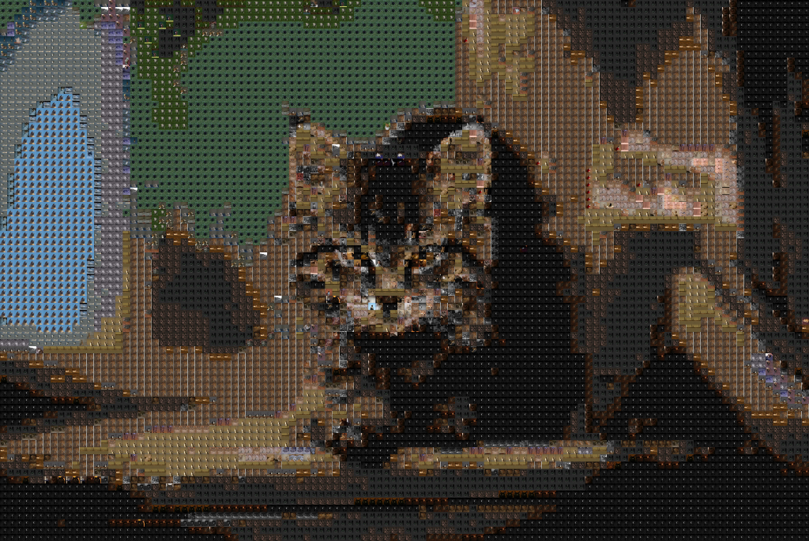
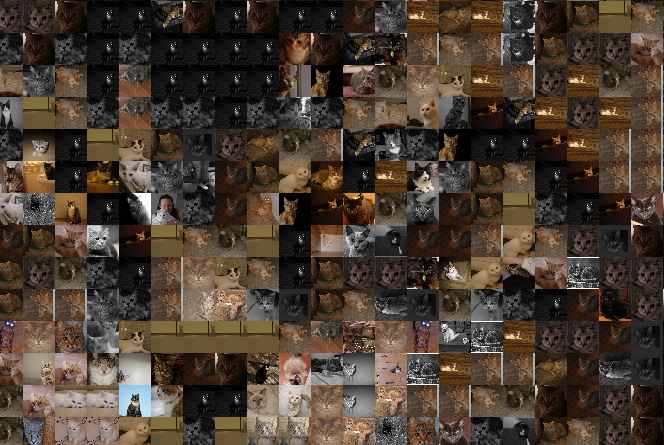

# Mosaic Maker - *OpenCV*

## About

The repository contains materials for classes at MIM UW.

The subject of these classes is the implementation of Mosaic generator. Take a
look at the picture of the cat below.

What looks like a pixelated picture remembering DOS era is a composition made 
out of a lot of smaller cats images:

You can find the full-size image version at 
`notebooks/assets/0-intro/cat-output.jpg`.

I used the [cat dataset](https://archive.org/details/CAT_DATASET/) (available 
also [here](https://www.kaggle.com/crawford/cat-data)) to create the image 
above. You can find the original image 
[here](https://unsplash.com/photos/OE7H8Zp1mw8).

The aim is to create an algorithm that generates *mosaic images* from the 
*target* and *source images* given as an input. By target image, I mean image 
that we want to recreate and as source images a set of pictures that will be 
used for the final composition.

## About the algorithm

The algorithm presented here is by no means any competition to the state of art
mosaic creation solutions. This project is meant to introduce basic *Numpy* and
*OpenCV* functions in a fun, exciting way, not to build the best mosaic creation
algorithm available. On the bright side, it is pretty fast :-)

You can find a description of the algorithm is in the Jupyter notebooks (see the
next section for details).

## How to use this repository?

The master branch contains a basic algorithm structure without crucial parts
implemented. Instead, you will find `ToDo` items describing what should be 
implemented in their place together with links to the documentation.

Jupyter notebooks describe step-by-step implementation instructions (you can
find them in the `notebooks` directory). Implementing the solution by following
notebooks is the recommended way of working with this repository.

If you are stuck with progress, you can refer to the `release/solution` branch
that contains a full implementation of the project.

 I recommend reading the
[Numpy quickstart](https://docs.scipy.org/doc/numpy/user/quickstart.html)
manual before starting the work.

In case of any issues or remarks, feel free to contact me.
